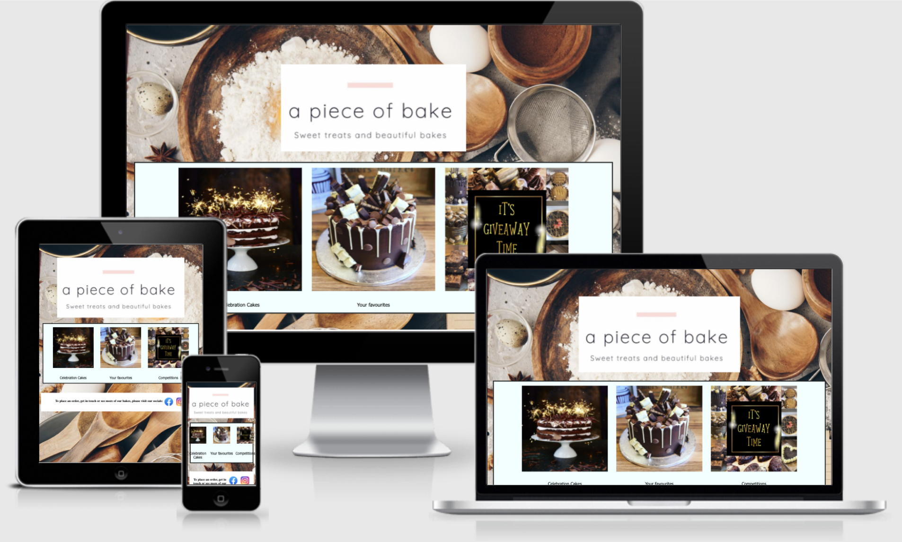

<h1>Piece of Bake Project</h1>

This is a bakery business that currently exists and is solely social media based.  This is a website to drive traffic to those social media pages to increase orders.

<h2>Features</h2>
Home page contains links to offerings of the business, celebration/favourites/competitions that are run via the social media pages embedded on the site.
Each link takes you to a new HTML site which shows the customers what types of bakes are available and once again directs to the social media sites

<h2> Testing</h2>
Checked on safari/chrome
Project is responsive
Built originally via replit - when transferring to GITPOD had to move images/code to align to new folder.
I have run in lighthouse and performance is an issue due to size of images but 100% achieved on accessibility
I have run on W3C validator which had some issues relating to % & PX use on images, which I corrected
No css issues identified in W3C validator

<h2>Deployment</h2>

Keyed originally in replit as I find it more user friendly than GITPOD.  Once built, moved over to GITPOD

<h2>Credit</h2>
All my own code
